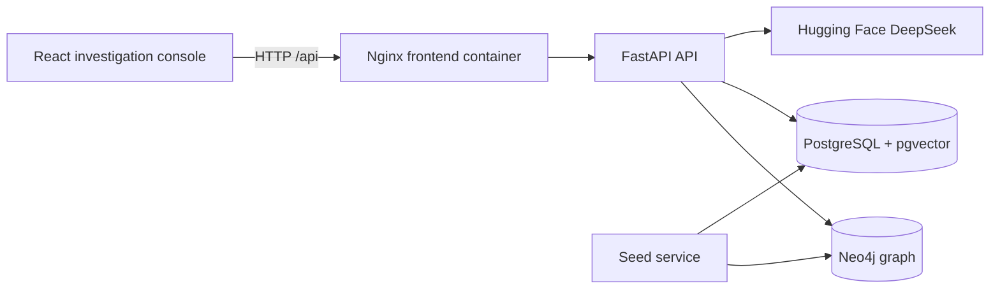

# Architecture

## Runtime services

- **Frontend** renders cases, network relationships, findings, profiles, evidence, timeline, map, summaries, and questions.
- **API** owns HTTP contracts and coordinates graph queries, document indexing, and RAG.
- **Neo4j** stores entities and relationships used by the graph and analytics views.
- **PostgreSQL + pgvector** stores case catalog rows and extracted document/evidence chunks with embeddings.
- **Seed** waits for both databases and inserts repeatable synthetic records.
- **Hugging Face** is called only for answer generation, unless hosted embeddings are explicitly enabled.

## Startup order

PostgreSQL and Neo4j become healthy first. The seed service then creates its schemas and inserts data. The API depends on successful seed completion. The frontend depends on the API container.

## Ownership rules

Graph relationships belong in Neo4j. Case metadata and searchable text belong in PostgreSQL. The frontend should call API routes rather than connecting to either database directly.
